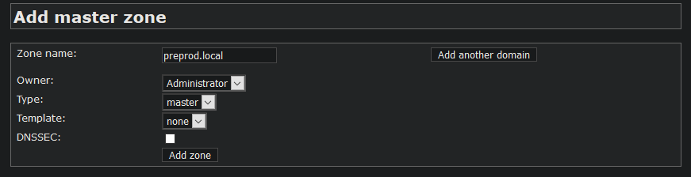

# tp-dns

## Question

* Connectez vous au host "proxy" avec vagrant et vérifier Comment est configuré le resolver dns du système ?

Le fichier resolv.conf est configuré pour redirigé vers les serveurs recursifs


* Retrouvez l'adresse ip du host wiki.lab.local avec la commande dig.
```
;; ANSWER SECTION:
wiki.lab.local.         3600    IN      A       192.168.56.11
```
l'adresse ip de wiki.lab.local est 192.168.56.11

* Connectez vous au host auth-1, quels sont les services réseaux qui sont en fonctionnement actuellement quels sont leur socket d'écoute ?

Les services réseaux qui fonctionnent sont http, mysql[3306] et pdns

* Connectez vous au host recursor-1,  quels sont les services réseaux qui sont en fonctionnement actuellement quels sont leur socket d'écoute ?

Le service réseaux qui fonctionent sont pdns 

* Où sont configuré chacuns de ces composants ?
```
/etc/pdns-recursor/recursor.conf
/etc/NetworkManager/NetworkManager.conf
/etc/httpd/conf/httpd.conf
/etc/my.cnf
```

* Qu'est ce qui est configuré sur les serveurs recursifs pour le domaine lab.local ? (Important pour les Actions qui suivent)

Un forward vers les serveurs authoritatifs est configuré pour lab.local sur les serveurs recursif
```
'147aforward-zones=lab.local=192.168.56.31;192.168.56.32'
```

* Comment mettre en évidence le fait que le récurseurs ne répondent que sur l’interface du réseaux back (192.168.33.0/24) 

En faisant la commande `dig wiki.lab.local @192.168.56.21` `dig wiki.lab.local @192.168.56.21`
ou en regardant l'interface d'écoute avec la commande `ss -4l` 
` tcp   LISTEN     0      128                                                                       192.168.33.21:domain                                                                                              *:*     `

* Comment est sécurisé l’accès à mysql ?

L'accés à mysql est sécurisé en suppriment la table PDNS et en creant une nouvelle table avec des accés redéfinie

## Actions

* Ajoutez un nouveau domaine "preprod.local" sur les serveurs autoritatifs interrogeable au travers des serveurs recursifs, décrivez vos actions.

Nous ajouterons le nouveau domaine en accedant d'abord à Poweradmin du serveur `auth-1` puis add master zone



* Mettez en place une config reverse-proxy pour les interfaces poweradmin. Vous préciserez vos actions et dans la configuration reverse proxy le socket d'écoute, le serveur name et la route web configuré.

On modifie le fichier de `nginx`

``` 
  upstream big_server_com { 
      server 192.168.33.31:80/poweradmin; 
      server 192.168.33.32:80/poweradmin;   
    }

  server {
      listen          80;
      server_name     poweradmin.com;
      access_log      logs/power.admin.access.log main;

      location / {
      proxy_pass      http://big_server_com;
      }
  }

```

* Mettez en place une sauvegarde des données dns.

Comme pour le TP1 on modifie la crontab pour sauvegarder les fichiers DNS toutes les 5min